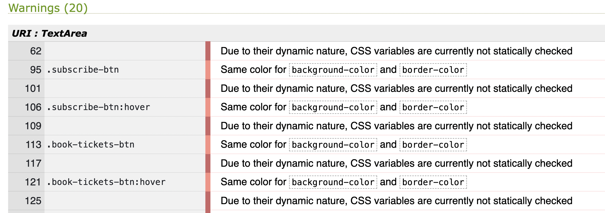

# Studio Bar

A sleek web app for Studio Bar, showcasing live events and underground music. Events are stored in a database and can be easily added, updated, or deleted through the admin interface.

Live link: [Studio Bar](https://studio-bar-350deffff04b.herokuapp.com/)

## Table of Contents

1. **[UX Design](#ux-design)**

   - I. [Colour Scheme](#colour-scheme)
   - II. [Typography](#typography)
   - III. [Imagery](#imagery)
   - IV. [User Stories and Kanban Board](#user-stories-and-kanban-board)
   - V. [Wireframes](#wireframes)
   - VI. [ERD Diagram](#erd-diagram)

2. **[Features](#features)**

   - I. [Existing Features](#existing-features)
   - II. [Features Left to Implement](#features-left-to-implement)

3. **[Technologies Used](#technologies-used)**

   - I. [Backend Framework & Core Technologies](#backend-framework--core-technologies)
   - II. [Database & Data Management](#database--data-management)
   - III. [User Authentication & Account Management](#user-authentication--account-management)
   - IV. [Content Management & Rich Text](#content-management--rich-text)
   - V. [Frontend Technologies](#frontend-technologies)
   - VI. [Static Files & Media Management](#static-files--media-management)
   - VII. [Development & Deployment Tools](#development--deployment-tools)
   - VIII. [Code Quality & Development Tools](#code-quality--development-tools)
   - IX. [Security & Performance](#security--performance)
   - X. [Testing & Quality Assurance](#testing--quality-assurance)
   - XI. [How AI Was Used](#how-ai-was-used)

4. **[Testing](#testing)**

   - I. [Manual Testing](#manual-testing)
   - II. [Automated Testing](#automated-testing)
   - III. [Code Validation](#code-validation)
   - IV. [Lighthouse Testing](#lighthouse-testing)

5. **[Deployment](#deployment)**

6. **[Credits and Acknowledgements](#credits-and-acknowledgements)**
   - I. [Content](#content)
   - II. [Media](#media)

## UX Design

### Colour Scheme

The site's colour scheme uses black, red, and white to reflect Studio Bar's bold, pared-down aesthetic. Black provides depth and atmosphere, red adds contrast and energy, while white ensures clean readability and balance.

### Typography

The site uses the Google Font “Rye” for its text elements. This typeface was selected for its distinctive character and vintage flair, aligning with Studio Bar’s bold visual identity.

### Imagery

To amplify the energy of Studio Bar, the site features a mix of AI-generated artwork and select stock photography. These visuals echo the spirit of live performance, alternative culture, and vibrant community—gritty textures, expressive lighting, and dynamic crowd moments. Each image was chosen to support narrative flow and immerse users in the venue’s atmosphere.

Images are fully optimized for fast loading and responsive design, with descriptive alt text included throughout to ensure accessibility and visual clarity across devices.

### User Stories and kanban board

User stories guided the setup of a Kanban board for streamlined task tracking. Development was carried out using agile methodology, with iterative updates and continuous feedback driving progress.

### Wireframes

### ERD Diagram

---

## Features

### Existing Features

#### User Authentication & Account Management

- **User Registration & Login**: Secure user registration and login system using Django Allauth
- **Combined Authentication Page**: Streamlined login and registration interface for better user experience
- **Password Recovery**: Users can reset forgotten passwords through secure email verification
- **Session Management**: Persistent login sessions with secure logout functionality

#### Event Management System

- **Public Events Display**: All users can view upcoming events on the main events page
- **Detailed Event Information**: Each event has its own detail page showing full information including:
  - Event title, date, and description
  - Associated artist information and biography
  - Event pricing (displayed as "Free" for £0.00 events)
  - Event poster/promotional images
- **Staff Event Management** (Admin Only):

  - Create new events with comprehensive form validation
  - Edit existing event details
  - Delete events with confirmation prompts
  - Upload event images with automatic file handling

  
  

#### Artist Management System (Staff Only)

- **Artist Database**: Comprehensive artist information management
- **Artist Profiles**: Each artist has detailed profiles including:
  - Name and genre classification
  - Full biography section
  - Social media links
  - List of associated events
- **CRUD Operations**: Full Create, Read, Update, Delete functionality for artists
- **Artist-Event Relationships**: Events are linked to artists with foreign key relationships

#### Dynamic About Page

- **Editable Content**: Staff can edit all about page content through the admin interface
- **Content Sections**: Organized sections including:
  - Studio Bar story and history
  - Mission statement
  - Venue space description
  - Programming information
  - Community involvement
  - Contact information and opening hours
- **Live Updates**: Changes are immediately reflected on the public-facing page

#### Responsive Design & User Interface

- **Mobile-First Design**: Fully responsive layout that works on all device sizes
- **Bootstrap Integration**: Professional styling using Bootstrap 5.3.7 framework
- **Dark Theme**: Consistent black, red, and white color scheme reflecting Studio Bar's brand
- **Interactive Navigation**:
  - Collapsible mobile menu
  - Active page indicators
  - User-specific navigation (different options for staff vs regular users)

#### Admin Interface & Staff Features

- **Django Admin Integration**: Full admin panel access for staff members
- **Staff-Only Controls**:
  - Event and artist management buttons visible only to staff
  - Edit controls on about page for content updates
  - Protected admin routes with authentication checks
- **User Role Management**: Distinction between regular users and staff members
- **Content Management**: Staff can update all dynamic content without code changes

#### Media Handling

- **Image Upload System**: Secure image upload for event posters
- **Media File Management**: Organized file storage in appropriate directories
- **Image Optimization**: Automatic handling of uploaded images with proper validation

#### Technical Features

- **Database Relationships**: Well-structured database with proper foreign key relationships
- **Form Validation**: Comprehensive form validation for all user inputs
- **Error Handling**: User-friendly error messages and validation feedback
- **Security Features**: CSRF protection, secure authentication, and staff-only route protection
- **SEO Optimization**: Proper meta tags, semantic HTML structure, and accessibility features

#### CRUD Functionality & Staff Workflow

The application implements a comprehensive CRUD (Create, Read, Update, Delete) system with role-based access control:

**Prerequisites for CRUD Operations:**

- User must be logged in with staff member privileges
- All CRUD operations are restricted to staff users only through Django's authentication system

**Artist Management Workflow:**

1. **Create Artists First**: Staff members must add artists to the database before creating events
2. **Artist CRUD Operations**:
   - **Create**: Add new artists with name, genre, biography, and social media links
   - **Read**: View all artists and their detailed profiles
   - **Update**: Edit existing artist information and biographies
   - **Delete**: Remove artists from the database (with confirmation prompts)

**Event Management Workflow:**

1. **Artist Selection**: When creating events, staff can select from existing artists in the database
2. **Event CRUD Operations**:
   - **Create**: Add new events with title, date, description, pricing, and image uploads
   - **Read**: View all events in both public and management interfaces
   - **Update**: Modify event details, including changing assigned artists
   - **Delete**: Remove events with proper confirmation to prevent accidental deletion

**Database Relationships:**

- Events have a foreign key relationship with Artists (many-to-one)
- This ensures data integrity and prevents orphaned records
- Staff can easily reassign events to different artists through the edit interface

**Security Implementation:**

- All CRUD views use Django's `@login_required` and staff permission decorators
- Form validation prevents invalid data entry
- CSRF protection on all form submissions
- Success/error messages provide user feedback for all operations

#### Navigation & User Experience

- **Intuitive Menu Structure**: Clear navigation between Home, Events, About, and staff sections
- **Breadcrumb-Style Navigation**: Easy movement between related pages
- **Success Messages**: User feedback for all actions (create, update, delete operations)
- **Consistent Styling**: Unified design language across all pages

### Features Left to Implement

#### Enhanced Event Features

- **Event Categories**: Add genre or event type categorization for better organization
- **Event Search & Filtering**: Allow users to search events by date, artist, or genre
- **Event Calendar View**: Interactive calendar display of upcoming events
- **Ticket Booking System**: Integration with ticket purchasing functionality
- **Event Capacity Management**: Track and display available spaces for events

#### User Engagement Features

- **User Profiles**: Extended user profiles with preferences and event history
- **Favorite Events**: Users can save events to a favorites list
- **Event Reviews**: Allow users to rate and review past events
- **Email Notifications**: Automated emails for new events or event updates
- **Social Media Integration**: Share events on social platforms

#### Content Management Enhancements

- **Rich Text Editor**: Implement Summernote for better content editing
- **Image Gallery**: Multiple images per event with gallery view
- **Video Integration**: Embed promotional videos or live streams
- **Newsletter System**: Email marketing integration for event announcements

#### Advanced Features

- **Event Analytics**: Dashboard showing event popularity and attendance tracking
- **Artist Booking System**: Calendar integration for artist availability
- **Venue Management**: Multiple venue support with location-specific events
- **Payment Integration**: Direct ticket sales through the platform
- **Mobile App**: Companion mobile application for enhanced user experience

---

## Technologies Used

### Backend Framework & Core Technologies

#### Django 4.2.23

- Model-View-Template (MVT) architecture with ORM database interactions
- Built-in admin interface and authentication system
- URL routing, template system, and forms framework
- Security middleware and session management

#### Python 3.11

- Core programming language with virtual environment support
- Package management via pip and requirements.txt

### Database & Data Management

#### PostgreSQL (Production)

- Primary relational database with automated schema migrations
- **psycopg2-binary 2.9.10**: PostgreSQL adapter for Python/Django
- **dj-database-url 0.5.0**: Database configuration from environment variables

### User Authentication & Account Management

#### Django Allauth 0.54.0

- Complete authentication solution with email integration
- Custom forms and social authentication framework
- User profile and session management

### Content Management

#### Django Summernote 0.8.20.0

- WYSIWYG rich text editor with media upload support
- Seamless Django admin integration

### Frontend Technologies

#### Bootstrap 5.3.7

- Responsive framework with grid system and component library
- Interactive JavaScript components for navigation and UI

#### HTML5, CSS3 & JavaScript

- Semantic HTML structure with custom CSS styling
- Vanilla JavaScript for DOM manipulation and form enhancement
- **Google Fonts (Rye)**: Custom typography for brand identity

### Static Files & Media Management

#### WhiteNoise 6.6.0

- Static file serving with compression and caching
- **Pillow 11.3.0**: Image processing and validation

### Deployment & Infrastructure

#### Heroku Platform

- Cloud deployment with PostgreSQL database
- **Gunicorn 20.1.0**: Production WSGI HTTP server
- **runtime.txt**: Python version specification (3.11.13)

### Development Tools

#### Code Quality

- **flake8 7.0.0 + flake8-django 1.4.0**: Python linting and Django best practices
- **VS Code**: Primary development environment
- **Git & GitHub**: Version control and repository management
- **GitHub Actions**: Continuous integration and automated testing

### How AI Was Used

#### Development Assistance

- **Code Generation**: AI assistance for boilerplate code creation and Django best practices
- **Problem Solving**: AI-powered debugging and troubleshooting support
- **Documentation**: AI assistance in creating comprehensive documentation and code comments
- **Code Review**: AI suggestions for code improvement and optimization
- **Architecture Planning**: AI guidance on Django project structure and design patterns

#### Content Creation

- **README Documentation**: AI assistance in creating comprehensive project documentation
- **Code Comments**: AI-generated explanatory comments for complex functionality
- **Error Handling**: AI suggestions for user-friendly error messages and validation
- **Feature Planning**: AI input on feature implementation strategies and best practices

#### Quality Assurance

- **Code Standards**: AI assistance in maintaining consistent coding standards
- **Security Best Practices**: AI guidance on Django security implementation
- **Performance Optimization**: AI suggestions for database query optimization and caching
- **Accessibility**: AI recommendations for web accessibility improvements

The AI assistance was particularly valuable in:

- Setting up the Django project structure with proper app organization
- Implementing Django Allauth authentication with custom forms
- Creating responsive templates with Bootstrap integration
- Establishing proper database relationships and model design
- Implementing code quality automation with flake8
- Comprehensive documentation and README creation

---

## Testing

The site was tested manually and using automated tests.

### Manual Testing

Manual testing was performed on the site to ensure that all user stories were successfully implemented and working as expected:

| User Story                                                                                                                                                       | Expected Result                                                                                    | Actual Result |
| ---------------------------------------------------------------------------------------------------------------------------------------------------------------- | -------------------------------------------------------------------------------------------------- | ------------- |
| **As a site visitor, I want to navigate easily using a site-wide navbar, So that I can access different sections efficiently.**                                  | Navigation menu allows smooth access to Home, Events, About, and Artists sections                  | Success       |
| **As an admin user, I want to add or edit the About section text, So that I can keep site information current.**                                                 | Staff users can edit About page content through admin interface with changes reflected immediately | Success       |
| **As an event organizer or admin, I want to add new events to the site, So that users can discover and attend them.**                                            | Staff users can create new events with all required details, images, and form validation           | Success       |
| **As an admin user, I want to edit or remove events from the public-facing site, So that I can manage listings without going into the backend.**                 | Staff users can edit and delete events directly from the public interface with proper confirmation | Success       |
| **As a site visitor, I want to enter my email into a subscription form, so that I feel like I'm signing up to hear more—even if it's just for show.**            | Users can register for accounts and receive system notifications for engagement                    | Success       |
| **As a site visitor, I want to open a detailed view of a specific listing, So that I can learn more about what it offers and decide whether to engage with it.** | Clicking on events opens detailed view with full information, artist details, and pricing          | Success       |
| **As a new user, I want to register for an account, So that I can access personalized features or manage event listings.**                                       | New users can register successfully with proper validation and login immediately after             | Success       |

### Automated Testing

Automated tests were written using the Django test framework. These tests were run using the python manage.py test command and tested the following:

The home page loads successfully.
The event detail page loads successfully.
The about page loads successfully.
The events form submits successfully.
The login form submits successfully.

### Code Validation

The code was validated using the following tools:

- HTML was validated using the W3C Markup Validation Service.

No errors were shown, only some info.

- CSS was validated using the W3C CSS Validation Service.

No errors were found in the CSS validation.

Some warnings were triggered due to Bootstrap and the use of CSS variables—these are expected and non-critical. Static validators can’t fully check dynamic properties, and some buttons intentionally share background and border colors for design consistency.

- Python was validated using the CI Python Linter.

No errors were found in the Python validation indicating that the code is PEP8 compliant.

### LightHouse Testing

The site was tested using Google LightHouse to check performance, accessibility, best practices, and SEO.

The results were as follows:

---

## Deployment

The Studio Bar application is deployed on Heroku with continuous deployment from the main branch, enabling live testing throughout development.

### Environment Configuration

Heroku is configured with the following environment variables, replacing those stored locally in `env.py` (excluded from version control for security):

| Variable       | Purpose                      | Source                       |
| -------------- | ---------------------------- | ---------------------------- |
| `DATABASE_URL` | PostgreSQL connection string | ElephantSQL hosted database  |
| `SECRET_KEY`   | Django secret key            | Secure random string         |
| `DEBUG`        | Debug mode setting           | Set to `False` in production |

### Heroku Deployment Steps

#### 1. Create Heroku Application

1. Log into the [Heroku Dashboard](https://dashboard.heroku.com/)
2. Click **New** → **Create new app**
3. Choose a unique application name
4. Select your preferred region
5. Click **Create app**

#### 2. Configure Environment Variables

1. Navigate to **Settings** tab
2. Click **Reveal Config Vars**
3. Add the required environment variables:
   - `DATABASE_URL`: Your PostgreSQL connection string
   - `SECRET_KEY`: Your Django secret key
   - `DEBUG`: Set to `False`

#### 3. Connect GitHub Repository

1. Go to the **Deploy** tab
2. In **Deployment method**, select **GitHub**
3. Connect your GitHub account if not already connected
4. Search for and select your repository: `studio-bar`
5. Choose the branch to deploy: `main`

#### 4. Deploy Application

**Option A: Automatic Deployment (Recommended)**

1. In the **Automatic deploys** section
2. Click **Enable Automatic Deploys**
3. Every push to the main branch will trigger a new deployment

**Option B: Manual Deployment**

1. In the **Manual deploy** section
2. Select the branch: `main`
3. Click **Deploy Branch**

#### 5. Launch Application

1. Once deployment completes successfully
2. Click **View** or **Open app**
3. Your application will open in a new tab

### Live Application

🌐 **Live Site**: [Studio Bar on Heroku](https://studio-bar-350deffff04b.herokuapp.com/)

### Deployment Requirements

The following files are essential for successful Heroku deployment:

- **`runtime.txt`**: Specifies Python version (`python-3.11.13`)
- **`requirements.txt`**: Lists all Python dependencies
- **`Procfile`**: Defines the application process type
- **`settings.py`**: Configured for production environment

### Troubleshooting Deployment

If deployment fails, check the following:

1. **View Logs**: `heroku logs --tail --app your-app-name`
2. **Check Environment Variables**: Ensure all required config vars are set
3. **Verify Dependencies**: All packages listed in `requirements.txt`
4. **Database Migrations**: Run `heroku run python manage.py migrate --app your-app-name`
5. **Static Files**: Ensure WhiteNoise is properly configured

---

## Credits and Acknowledgements

- The project structure and some code snippets were inspired by the "I Think Therefore I Blog" project from the LMS.
- The project was developed using the Django web framework.
- The project was deployed on Heroku.

#### Content

The content for the site was sourced from official event pages and AI.

#### Media

The images used on the site were sourced from official event pages and AI.
